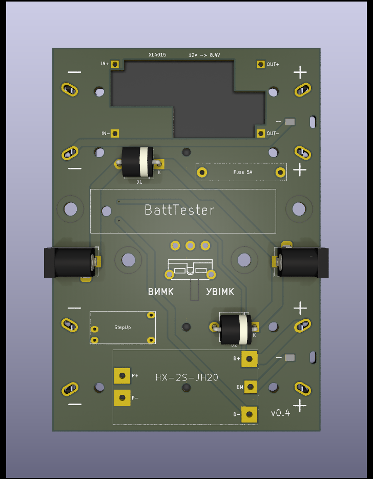

# Battery UPS Kicad design

* BMS-2S-2P (2 cells with 2 parallel batteries each) HX-2S-JH20
* Support both 18650 and 21700 Li-Ion batteries
* XL4015 StepDown: 12V -> 8.4V
* A very cheap StepUp: 8.4V -> 12V
* Fuse 5A, switch, battery capacity tester
* Diodes to bypass current if mains is powered
* DC 5.5 2.1 input and output jackets

[Schematics](./schematics.pdf)

